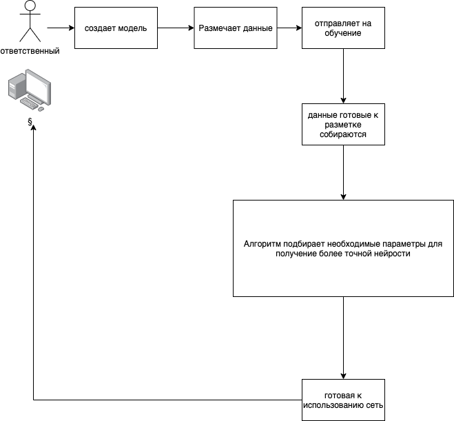

# ШИВА проект команды "Чугунный скороход"

Сервис, определяющий направленность входного текста с применением ансамбля нейросетей, которые может использовать и настраивать любой человек без спец. знаний.



#### Demo
http://south.insrt.ru/

#### Презентация
[PDF](./presentation.pdf)

## Запуск

Для запуска системы требуется `Docker` и `make`

#### Установка
```bash
make install
```

#### Запуск
```bash
make run
```

#### Остановить
```bash
make stop
```

